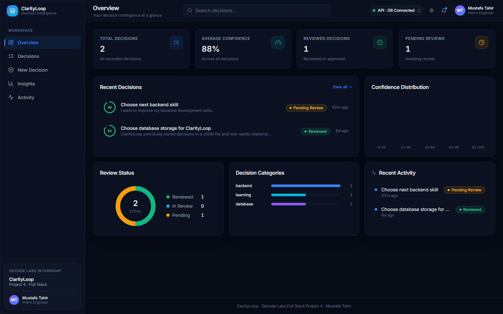
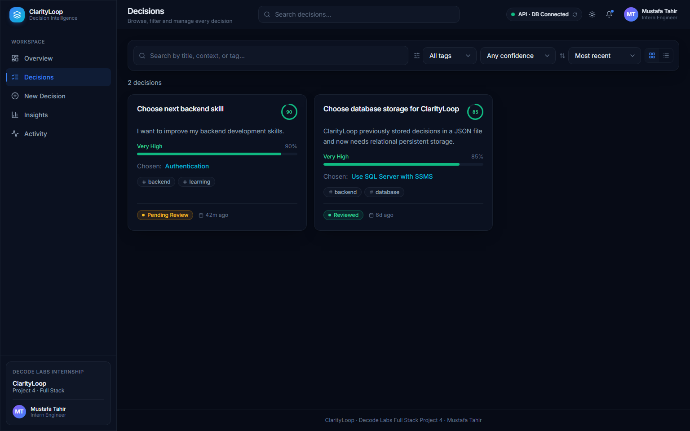
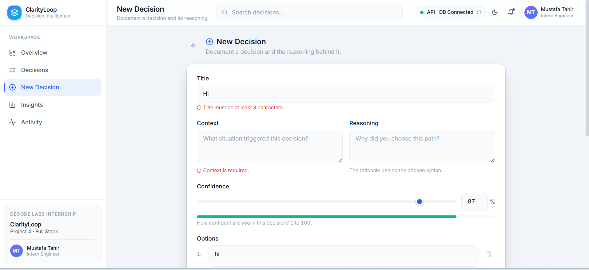
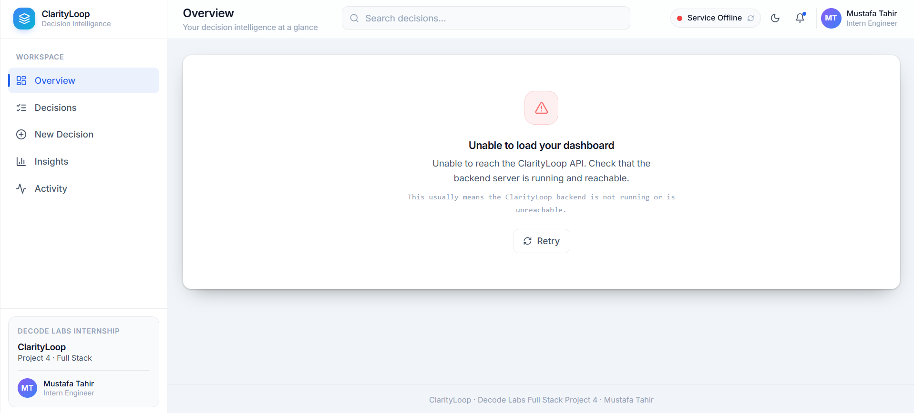
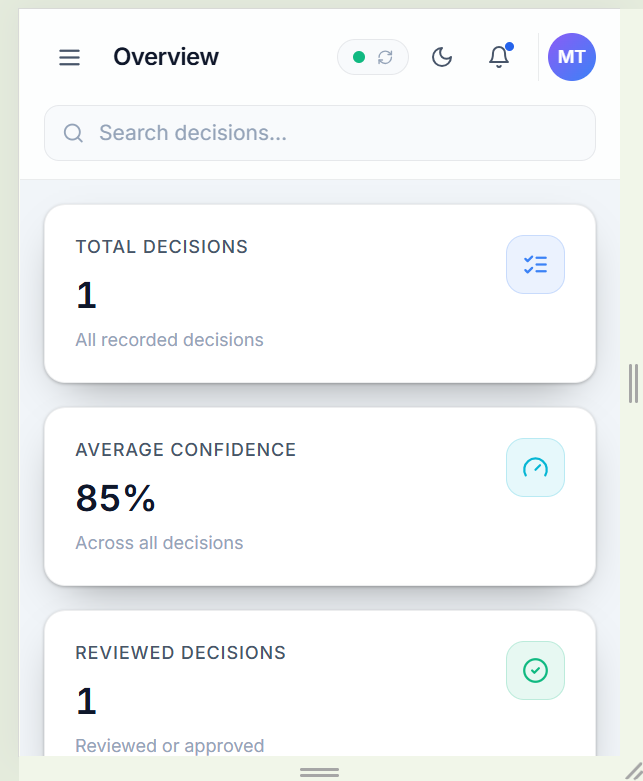

# ClarityLoop — Full Stack Decision Intelligence

**Decode Labs Full Stack Development Internship — Project 4: Frontend & Backend Integration**

ClarityLoop is a full stack decision management application that connects a responsive React frontend to a Node.js / Express REST API and Microsoft SQL Server database.

Project 4 focuses on the complete integration flow: the frontend sends asynchronous requests, the backend validates and processes them, SQL Server persists the data, and the UI renders the returned results.

## Project Overview

ClarityLoop records important decisions together with their:

- Context and reasoning
- Confidence level
- Alternative options
- Selected option
- Tags
- Review date and review status

The application includes an Overview dashboard, Decisions workspace, New Decision form, Insights page, Activity timeline, responsive mobile navigation, validation, and service-health handling.

## Architecture

```text
React + Vite + TypeScript
          |
          | Fetch API / async-await / JSON
          v
Node.js + Express REST API
          |
          | Parameterized SQL
          v
Microsoft SQL Server
      ClarityLoopDB
```

## Technology Stack

### Frontend
- React 18
- Vite 5
- TypeScript
- Tailwind CSS
- Lucide React
- Fetch API

### Backend
- Node.js
- Express.js
- `mssql`
- `msnodesqlv8`
- dotenv
- CORS

### Database
- Microsoft SQL Server
- SQL Server Management Studio
- Relational tables and constraints
- Parameterized queries and transactions

## Main Features

- Live API and database health status
- Dynamic dashboard statistics
- Searchable and filterable decision workspace
- Create, read, update and delete decision workflows
- Multiple options with a selected choice
- Confidence tracking
- Tags and review states
- Client-side and server-side validation
- Graceful backend-offline state with Retry
- Light and dark themes
- Responsive mobile layout

## REST API

| Method | Endpoint | Purpose |
|---|---|---|
| `GET` | `/api/health` | Check API and database health |
| `GET` | `/api/v1/decisions` | Retrieve all decisions |
| `GET` | `/api/v1/decisions/:id` | Retrieve one decision |
| `POST` | `/api/v1/decisions` | Create a decision |
| `PUT` | `/api/v1/decisions/:id` | Update a decision |
| `DELETE` | `/api/v1/decisions/:id` | Delete a decision |

## Database Design

ClarityLoopDB uses the following main tables:

- `Decisions`
- `DecisionOptions`
- `Reviews`
- `Tags`
- `DecisionTags`

The schema models one-to-many decision options, one-to-one reviews, and many-to-many decision tags.

## Screenshots

### Connected Dashboard



### Decision Management



### Validation and Failure Handling





### Responsive Mobile Interface



## Local Setup

### Prerequisites

Install:

- Node.js and npm
- Microsoft SQL Server
- SQL Server Management Studio
- ODBC Driver 18 for SQL Server

### 1. Database

For a fresh database, open SQL Server Management Studio and run:

```text
database/ClarityLoopDB_Schema.sql
```

Optional test and verification scripts:

```text
database/ClarityLoopDB_TestData.sql
database/ClarityLoopDB_Verification.sql
```

### 2. Backend

```bash
cd backend
npm install
copy .env.example .env
npm run db:test
npm start
```

Backend:

```text
http://localhost:5000
```

Health endpoint:

```text
http://localhost:5000/api/health
```

### 3. Frontend

Open another terminal:

```bash
cd frontend
npm install
copy .env.example .env
npm run dev
```

Frontend:

```text
http://localhost:5173
```

When all services are available, the application displays **API · DB Connected**.

## Environment Files

Only safe examples are included in this repository.

Backend `.env.example`:

```env
PORT=5000
DB_CONNECTION_STRING=
CORS_ORIGIN=http://localhost:5173,http://127.0.0.1:5173
```

Frontend `.env.example`:

```env
VITE_API_BASE_URL=http://localhost:5000
```

Do not commit real `.env` files or database credentials.

## Testing Evidence

The project was manually verified for:

- SQL Server database connectivity
- API health
- Reading decisions from persistent storage
- Creating a decision
- Updating a decision
- Deleting a decision
- Client-side validation
- Backend-offline handling and recovery
- Responsive mobile layout

Evidence screenshots are available in [`screenshots/`](screenshots/).

## Project Report

The final technical report is available here:

[`Mustafa_Tahir_ClarityLoop_Project_4_Report.pdf`](report/Mustafa_Tahir_ClarityLoop_Project_4_Report.pdf)

## Repository Structure

```text
Project-4-ClarityLoop-FullStack/
├── frontend/
├── backend/
├── database/
├── docs/
├── screenshots/
├── report/
├── .gitignore
├── SETUP_WINDOWS.md
├── setup.bat
├── start-dev.bat
└── README.md
```

## Author

**Mustafa Tahir**  
Full Stack Development Intern  
Decode Labs — Batch 2026
